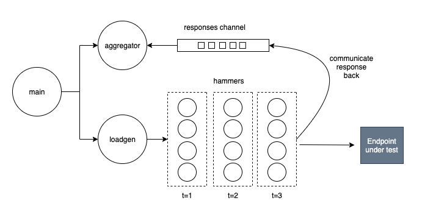

# go-hammer


A (work in progress) load generator in Go.

## Why Go?

A load generator has the ability to generate _concurrent_ requests against a defined target, and one of the nicest features in Go is actually [Concurrency](https://www.youtube.com/watch?v=cN_DpYBzKso) –– It is easy to program and also very resource efficient. [Goroutines](https://golang.org/doc/faq#goroutines) and [Channels](https://golangbot.com/channels/) are the main characters involved in it. Goroutines are basically functions that run concurrently with other functions; Not to be confused with threads, goroutines are actually multiplexed to a limited number of OS threads and is one of the reasons why concurrency in Go is efficient. Channels are message pipes where Goroutines can communicate to each other in a race-condition-safe manner.

## TPS Generator

**Goroutine per request**  
There are as many goroutines as TPS specified spawned every second. I'm calling them Hammers, they are short-lived because they die as soon as their request is over, and they can be of different types to extend the system. For example a hammer of type HTTP knows how to trigger HTTP requests, but a hammer of type IoT knows how to generate MQTT requests. This allows for the actual testing logic to be decoupled from the load generation orchestration. The following diagram illustrates the goroutines involved, which are represented by circles:



My initial concern with this approach was the high number of goroutines created every second, but this seems to be less of a concern as goroutines are very efficient and lightweight. However I'm still worried about a situation where the endpoint under test is slow to respond, causing the Hammers to take longer to complete and the _running active_ count of Hammers will start to pile up. 

**TODO:** Find out if the aggregator goroutine will become a bottleneck? When the Hammers write to the _responses channel_ they block until the _aggregator_ reads; This is the nature of how channels work because they are also a synchronization mechanism, however, this may cause the _aggregator_ to become a bottleneck as it will block the Hammers until it catches up draining the channel.

### Other approaches considered

**Long living goroutines**  
Create as many goroutines as TPS specified where each goroutine is in charge of generating a request (i.e. HTTP) every second. The challenge is that the goroutine waits for the request to resolve and if it takes longer than a second, the system as whole will not meet the desired TPS.

## Reporting

The approach for reporting results would be for each goroutine to send results of the requests to a shared Channel. There is a separate goroutine in charge of listening for these results and keeping a running count and do a summary at the end. Challenge? How does this goroutine know that all requests have finished and when should it start to calculate the final results?

## Profiling

```
go test -cpuprofile cpu.prof -memprofile mem.prof -bench .
go tool pprof cpu.prof
```

## Limits

The max TPS seems to be constrained by the host OS max open files limit. The package net/http opens a socket for every HTTP request in-flight. In my macbook this seems pretty low as it breaks at ~225 TPS. Command to find this limit:

```
ulimit -n
```

Need to test on an EC2 and within a Fargate container and compare.

## Testing

Functional testing is done by spinning up a local web server and then pointing the load generator against it. The local web server verifies that the expected number of requests generated are actually received.

```
go test -v
```

## Other thoughts

**Distribute requests evenly within the timeframe of a second?**  
The current implementation triggers all requests in the beginning of a second, obviously each consecutive request is triggered slightly (a few microseconds?) after the previous one, but this means that all the remaining time before the second is over is empty and quiet with no requests. I suspect that distributing all of these requests evenly within the timeframe of a second would mimic real-world traffic more realistically and will create less pressure on the system under test.